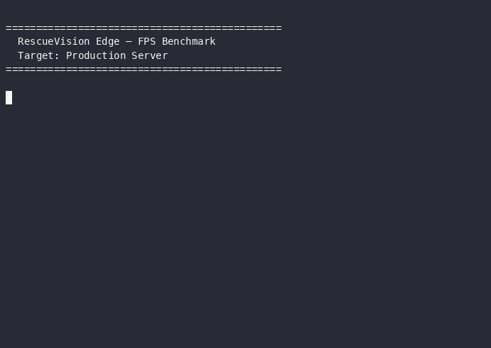

<p align="center">
  
  
  
  
  
  
  
</p>

<h1 align="center">🚁 RescueVision Edge</h1>
<p align="center"><b>Lightweight Sovereign AI for On-Device Victim Localization</b><br>in Post-Disaster Aerial Assessment</p>

<p align="center">
  <i>Universitas Darussalam Gontor (UNIDA)</i>
</p>

---

## 📋 Ringkasan

RescueVision Edge adalah sistem deteksi korban bencana dari citra udara _drone_ yang berjalan **sepenuhnya luring** tanpa cloud/API eksternal. YOLOv8n → ONNX (11.70 MB), CPU-only, latensi <40 ms.

| Aspek | Detail |
|-------|--------|
| **Model** | YOLOv8n → ONNX (11.70 MB) |
| **Inference** | CPU-only via `CPUExecutionProvider` |
| **Latensi** | ~30 ms rata-rata (max 38.1 ms) |
| **Akurasi** | mAP@0.5 **0.5280** (pedestrian) |
| **Frontend** | React + Vite + Leaflet |
| **Backend** | FastAPI + ONNX Runtime |
| **Offline** | ✅ Zero external API |

---

## ✅ Constraint Track A

| # | Constraint | Requirement | Status |
|:-:|------------|-------------|:------:|
| **C-A1** | Ukuran Model | ≤ 50 MB | ✅ `11.70 MB` |
| **C-A2** | Platform | CPU-only | ✅ `CPUExecutionProvider` |
| **C-A3** | Kecepatan | ≤ 3.000 ms | ✅ `38.1 ms max` |
| **C-A4** | Framework | PyTorch / ONNX | ✅ Ultralytics + ONNX Runtime |
| **C-A5** | Offline | Zero API calls | ✅ Fully offline |

---

## 🎬 Demo

<table>
  <tr>
    <td width="25%" align="center">
      <br>
      <b>🐳 Docker</b><br>
      <sub>compose up → deteksi</sub>
    </td>
    <td width="25%" align="center">
      <br>
      <b>🔌 API</b><br>
      <sub>OpenAPI → inject → GPS</sub>
    </td>
    <td width="25%" align="center">
      <br>
      <b>⚡ Benchmark</b><br>
      <sub>8 frame → avg 157 ms</sub>
    </td>
    <td width="25%" align="center">
      <br>
      <b>🎛️ Setup RPi</b><br>
      <sub>scripts/setup_pi.sh</sub>
    </td>
  </tr>
</table>

<p align="center">
  <a href="https://rescue-vision-edge.utc.web.id">
    
  </a>
  &nbsp;
  <a href="docs/demo_detect.png">
    
  </a>
</p>

<p align="center">
  📍 <a href="https://rescue-vision-edge.utc.web.id">Frontend</a> &nbsp;•&nbsp;
  <a href="https://rescue-vision-edge.utc.web.id/api">API</a> &nbsp;•&nbsp;
  <a href="https://rescue-vision-edge.utc.web.id/api/docs">Swagger UI</a>
</p>

---

## 🚀 Quick Start

```bash
# Docker (recommended)
cp model/best.onnx model.onnx
docker compose up --build     # → localhost:3000

# Development (2 terminal)
cd backend && pip install -r requirements.txt && uvicorn app.main:app --reload --port 8000
cd frontend && npm install && npm run dev -- --port 5173

# Raspberry Pi 4
sudo ./scripts/setup_pi.sh   # auto-install semua dependensi
```

---

## 📡 API

| Method | Endpoint | Fungsi |
|--------|----------|--------|
| `GET` | `/health` | Status sistem + model |
| `POST` | `/detect` | Deteksi 1 gambar |
| `POST` | `/detect/batch` | Batch (max 100) |
| `POST` | `/inject` | Inject config dinamis |
| `GET` | `/export/csv` | Export CSV |
| `GET` | `/export/json` | Export JSON |

```bash
curl -X POST "http://localhost:8000/detect?manual_lat=-7.34&manual_lon=110.45" \
  -F "file=@drone_test_frames/frame_0008.jpg"
```

---

## 📊 Benchmark

| Metrik | YOLOv5n | YOLOv8n |
|--------|:-------:|:-------:|
| mAP@0.5 | 0.4684 | **0.5280** |
| ONNX size | 7.49 MB | 11.70 MB |
| CPU latency (max) | 19.8 ms | **38.1 ms** |

> Detail: `docs/architecture_comparison.txt` · `docs/demo-benchmark.gif`

---

## 🗂️ Struktur

```
RescueVision/
├── scripts/        # Utilitas: dataset, benchmark, setup RPi
├── backend/app/    # FastAPI: routes, inference, GPS
├── frontend/src/   # React: components, hooks, API client
├── docs/           # Demo GIF/Cast, proposal, laporan
├── notebooks/      # Training + inference notebook
└── docker-compose.yml
```

---

## 👥 Tim

| Nama | Role |
|------|:----:|
| Farrel Ghozy Affifudin | DevOps & Frontend |
| Fatih Jawwad Al Mumtaz | AI/ML & Backend |

---

## 📄 Lisensi

Dataset VisDrone-DET 2019 — riset non-komersial. Model YOLOv8n — AGPL-3.0.

---


