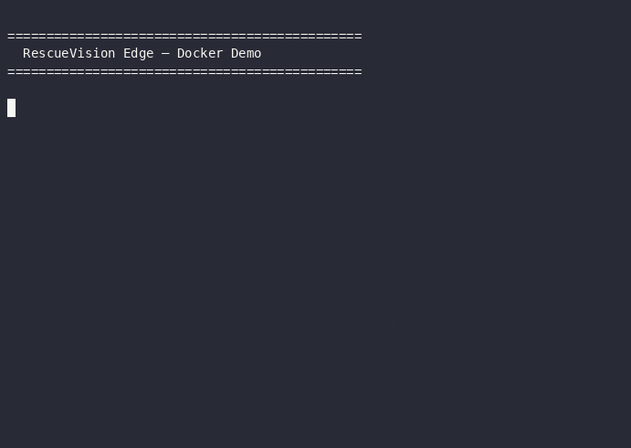
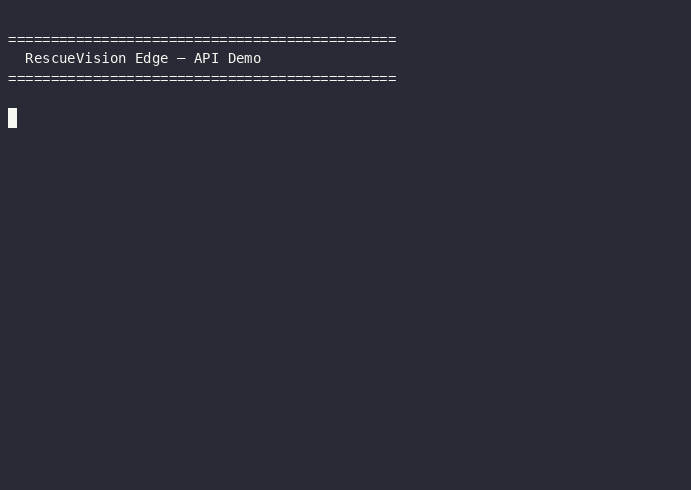
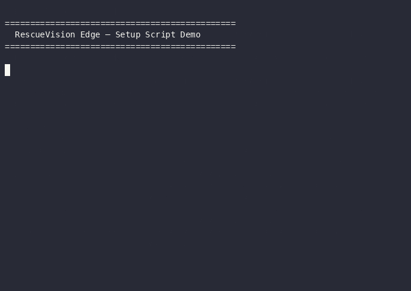

<p align="center">
  
  
  
  
  
  
  
</p>

<h1 align="center">🚁 RescueVision Edge</h1>
<p align="center"><b>Lightweight Sovereign AI for On-Device Victim Localization</b><br>
in Post-Disaster Aerial Assessment</p>

<p align="center">
  <i>Hackathon FindIT! 2026 — Track A: The Edge Vision (Computer Vision)</i><br>
  <i>Universitas Darussalam Gontor (UNIDA) — Tim Hamba tuhan yang mahaesa</i>
</p>

---

## 📋 Ringkasan

**RescueVision Edge** adalah sistem deteksi korban bencana dari citra udara *drone* yang berjalan **sepenuhnya secara luring** (_offline_), tanpa ketergantungan pada _cloud computing_ atau API eksternal apapun.

| Aspek | Detail |
|-------|--------|
| **Model** | YOLOv8n → ONNX (11.70 MB) |
| **Inference** | CPU-only via `CPUExecutionProvider` |
| **Latensi** | <40 ms per citra (rata-rata 30.4 ms) |
| **Akurasi** | mAP@0.5 **0.5280** (pedestrian) |
| **Frontend** | React + Vite + Leaflet map |
| **Backend** | FastAPI + ONNX Runtime |
| **Offline** | ✅ Zero external API calls |

---

## ✅ Kepatuhan Constraint Track A

| # | Constraint | Requirement | Implementasi | Status |
|:-:|------------|-------------|--------------|:------:|
| **C-A1** | Ukuran Model | ≤ 50 MB | ONNX `11.70 MB` | ✅ PASS |
| **C-A2** | Platform | CPU-only capable | `CPUExecutionProvider` | ✅ PASS |
| **C-A3** | Kecepatan | ≤ 3.000 ms/sampel | `38.1 ms max` | ✅ PASS |
| **C-A4** | Framework | PyTorch / ONNX Runtime | Ultralytics + ONNX Runtime | ✅ PASS |
| **C-A5** | Offline Total | Tanpa API eksternal | Zero external calls | ✅ PASS |

---

## 🎬 Demo

<table>
  <tr>
    <td width="33%" align="center">
      <a href="demo-docker.cast">
        <br>
        <b>🐳 Docker Deployment</b>
      </a><br>
      <sub><code>docker-compose up</code> → health check → deteksi via API</sub>
    </td>
    <td width="33%" align="center">
      <a href="demo-api.cast">
        <br>
        <b>🔌 API & Swagger</b>
      </a><br>
      <sub>OpenAPI → health → inject → deteksi + GPS mapping</sub>
    </td>
    <td width="33%" align="center">
      <a href="demo-benchmark.cast">
        <br>
        <b>⚡ FPS Benchmark</b>
      </a><br>
      <sub>8 frame → avg 157 ms → <b>6.4 FPS</b> ✅ C-A3</sub>
    </td>
  </tr>
  <tr>
    <td width="33%" align="center">
      <a href="demo-setup.cast">
        <br>
        <b>🎛️ Setup RPi 4</b>
      </a><br>
      <sub><code>scripts/setup_pi.sh</code> — help, verifikasi, struktur</sub>
    </td>
    <td colspan="2" align="center" valign="middle">
      <br>
      <a href="https://rescue-vision-edge.utc.web.id">
        
      </a>
      <br><br>
      <table>
        <tr><td><b>Frontend</b></td><td><a href="https://rescue-vision-edge.utc.web.id">rescue-vision-edge.utc.web.id</a></td></tr>
        <tr><td><b>Backend API</b></td><td><a href="https://rescue-vision-edge.utc.web.id/api">rescue-vision-edge.utc.web.id/api</a></td></tr>
        <tr><td><b>Swagger UI</b></td><td><a href="https://rescue-vision-edge.utc.web.id/api/docs">rescue-vision-edge.utc.web.id/api/docs</a></td></tr>
      </table>
      <br>
    </td>
  </tr>
</table>

---

## 📦 Struktur Repository

```
RescueVision/
│
├── 📓 notebooks/
│   ├── training.ipynb               # Full training pipeline
│   └── inference.ipynb              # CPU inference demo
│
├── 📜 scripts/
│   ├── prepare_visdrone.py          # VisDrone → YOLO converter
│   ├── verify_split.py              # Zero data leakage checker
│   ├── benchmark_cpu.py             # CPU latency benchmark
│   ├── check_run.py                 # Checkpoint inspector
│   ├── precache_tiles.py            # Offline OSM tile downloader
│   └── setup_pi.sh                  # Raspberry Pi 4 auto-installer
│
├── 🖥️ backend/                      # FastAPI (Tahap 3)
│   └── app/
│       ├── main.py                  # Routes + startup
│       ├── inference.py             # ONNX Runtime engine
│       ├── models.py                # Pydantic schemas
│       └── gps.py                   # GPS EXIF → coordinate math
│
├── 🌐 frontend/                     # React + Vite (Tahap 3)
│   └── src/
│       ├── components/              # UploadZone, DetectionResult, VictimMap..
│       ├── services/api.js          # Axios API client
│       ├── hooks/useAppLogic.js     # State management
│       └── utils/videoProcessor.js  # Frame extraction
│
├── 📷 drone_test_frames/            # 8 sample drone images
├── 📊 demo-*.cast / demo-*.gif      # Demo recordings
├── 📄 docs/                         # Proposal + compliance reports
├── 🐳 docker-compose.yml            # Backend + frontend orchestration
├── dataset.yaml                     # Ultralytics dataset config
├── requirements.txt                 # Python dependencies
└── README.md                        # ← You are here
```

---

## 🚀 Quick Start

### 🐳 Docker (Recommended)

```bash
# 1. Place your trained model
cp model/best.onnx model.onnx

# 2. Build & start
docker compose up --build

# 3. Open browser
open http://localhost:3000       # Frontend
open http://localhost:8000/docs  # Swagger UI
```

| Service  | URL                     |
|----------|-------------------------|
| Frontend | http://localhost:3000    |
| Backend  | http://localhost:8000    |
| API Docs | http://localhost:8000/docs |

```bash
# Stop
docker compose down
```

### 🍇 Raspberry Pi 4 (ARM64)

```bash
sudo ./scripts/setup_pi.sh

# Options
sudo ./scripts/setup_pi.sh --skip-system-update --model-path /path/to/model.onnx
```

Script `setup_pi.sh` otomatis menangani:
1. ✅ Pre-flight — arsitektur, RAM, disk, OS
2. ✅ System packages — OpenCV, Python 3, Node.js 18+, Nginx
3. ✅ Swap — auto-konfigurasi untuk Pi 2GB/4GB
4. ✅ Python venv — ONNX Runtime (ARM64 fallback), FastAPI, OpenCV
5. ✅ Frontend build — `npm install` + `npm run build` (production)
6. ✅ Systemd services — backend auto-start + Nginx reverse proxy
7. ✅ Firewall — port 80 dan 8000

### 💻 Development (2 Terminal)

**Terminal 1 — Backend:**
```bash
cd backend
python3 -m venv .venv && source .venv/bin/activate
pip install -r requirements.txt
uvicorn app.main:app --host 0.0.0.0 --port 8000 --reload
```

**Terminal 2 — Frontend:**
```bash
cd frontend
npm install
npm run dev -- --host 0.0.0.0 --port 5173
```

---

## 📡 API Endpoints

| Method | Endpoint | Description |
|--------|----------|-------------|
| `GET` | `/health` | System health + model status |
| `POST` | `/detect` | Single image victim detection |
| `POST` | `/detect/batch` | Batch image processing (max 100) |
| `POST` | `/inject` | Dynamic config injection (Tahap 3) |
| `GET` | `/export/csv` | Export detections as CSV |
| `GET` | `/export/json` | Export detections as JSON |
| `POST` | `/export/clear` | Clear detection logs |
| `GET` | `/api/tiles/{z}/{x}/{y}.png` | Offline OSM tile proxy |

**Contoh deteksi dengan GPS manual:**
```bash
curl -X POST "http://localhost:8000/detect?manual_lat=-7.34&manual_lon=110.45&manual_altitude=80" \
  -F "file=@drone_test_frames/frame_0008.jpg"
```

---

## 🧠 Training

Buka `notebooks/training.ipynb` dan jalankan semua sel.

```python
model   = 'yolov8n.pt'   # 3.2M parameter
imgsz   = 640
batch   = 16
epochs  = 100             # early stopping patience=20
device  = 0               # NVIDIA RTX 4060
```

---

## 📊 Benchmark

### CPU Latency (Production Server — 8 frame)

| Gamba | Inference (ms) | Victim |
|:------|:--------------:|:------:|
| frame_0001 | 255.6 | 2 |
| frame_0002 | 130.1 | 2 |
| frame_0003 | 213.2 | 1 |
| frame_0004 | 131.2 | 2 |
| frame_0005 | 131.1 | 3 |
| frame_0006 | 130.2 | 1 |
| frame_0007 | 134.2 | 4 |
| frame_0008 | 132.7 | 2 |
| **Rata-rata** | **157.3 ms** | **17 total** |
| **FPS** | **6.4 fps** | |

```bash
# Run locally
python scripts/benchmark_cpu.py --model model/best.onnx --images test_data/images/ --n 30
```

### YOLOv5n vs YOLOv8n

| Metrik | YOLOv5n (baseline) | YOLOv8n (final) |
|--------|:------------------:|:----------------:|
| mAP@0.5 | 0.4684 | **0.5280** |
| mAP@0.5:0.95 | 0.1728 | **0.2159** |
| ONNX size | 7.49 MB | 11.70 MB |
| CPU latency (mean) | 18.0 ms | 30.4 ms |
| CPU latency (max) | 19.8 ms | 38.1 ms |

YOLOv8n unggul **+5.96 poin mAP@0.5** dengan latensi masih jauh di bawah 3.000 ms.

---

## 🗺️ Dataset

**VisDrone-DET 2019** — Object Detection in Images

| Split | Jumlah | Lokasi |
|-------|:------:|--------|
| Train | 5.655 | `train_data/images/train/` |
| Val | 530 | `train_data/images/val/` |
| Test | 1.265 | `test_data/images/` |

Hanya kelas **pedestrian** yang digunakan. Zero data leakage — diverifikasi via MD5 fingerprinting.

---

## 👥 Tim

| Nama | NIM | Peran |
|------|:---:|:-----:|
| Wafa Bila Syaefurokhman | 442023611098 | — |
| Farrel Ghozy Affifudin | 452024611053 | — |
| Fatih Jawwad Al Mumtaz | 452024611047 | — |
| Sabri Mutiur Rahman | 442023611104 | — |

---

## 📄 Lisensi

- Dataset VisDrone-DET 2019 — riset dan kompetisi non-komersial
- Model YOLOv8n — AGPL-3.0 (Ultralytics)
- Kode RescueVision Edge — Tim Hamba tuhan yang mahaesa (UNIDA)

---

<p align="center">
  <i>Made with ❤️ for FindIT! 2026 — Track A: The Edge Vision</i>
</p>
